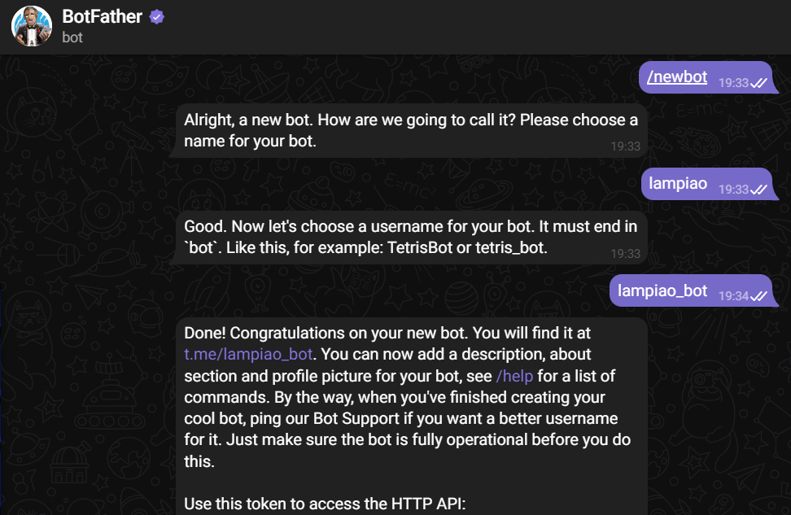
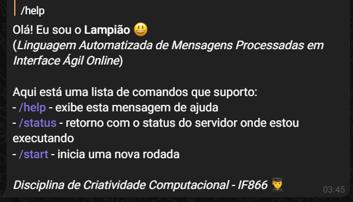

## LampiãoBot

> Olá! Eu sou o Lampião (Linguagem Automatizada de Mensagens Processadas em Interface Ágil Online) - Um bot no Telegram 😃
#

# Configurando o projeto ⚙

## 1. Criando bot no Botfather do Telegram

Criar um bot no telegram é muito simples, basta enviar o comando `/newbot` para [@BotFather](https://t.me/botfather) e seguir as etapas até receber um novo token.



O token ficará mais ou menos assim:
```shell
4839574812:AAFD39kkdpWt3ywyRZergyOLMaJhac60qc
```

## Uma vez o bot criado e termos o token para sua api, vamos à configuração do servidor para rodar o script

## 1. Clonando o repositório
```shell
git clone git@github.com:
```

## 2. Acessando a pasta criada
```shell
cd lampiaobot
```

## 3. Caso deseje utilizar um ambiente virtual com o Pipenv
```shell
pipenv shell
```
> Se o `pipenv` não estiver instalado, o instale via pip: `pip install pipenv`

### 3.1 Instalando dependências
```shell
pipenv install
```

> Ps* Caso não deseje utilizar um ambiente virtual, as dependências estão descritas no arquivo [requirements.txt](requirements.txt)
#

## 4. Criando um arquivo `.env` com os acessos necessários para as API's. Você pode utilizar o arquivo [example.env](example.env) como guia:
```shell
TELEGRAM_TOKEN="abcdefghijklmonwqs:1235492919120021023"
REPLICATE_API_TOKEN = "xxxxxxxxxxxxxxxxxxxxxxxxxxxxxxxxx"
OPENAI_API_KEY="xx-xxxxxxxxxxxxxxxxxxxxxxxxxxxxxxxxxxxx"
OPENAI_ORGANIZATION="org-xxxxxxxxxxxxxxxxxxxxxx"
```

## 5. Executando o bot!
```shell
python3 bot.py
```

## 6. Validando a execução
No telegram, envie o comando `/help` ou `/status` para o bot e confirme que ele respondeu com sucesso!


---
---
> ## PS* Caso adicionado a um grupo, para que consiga visualizar as mensagens, o bot precisa ter sido atribuído o cargo de administrador do grupo!

---
```
Centro de Informática da Universidade Federal de Pernambuco
Curso Bacharelado em Sistemas de Informação
Disciplina de Criatividade Computacional - IF866 👨‍🎓